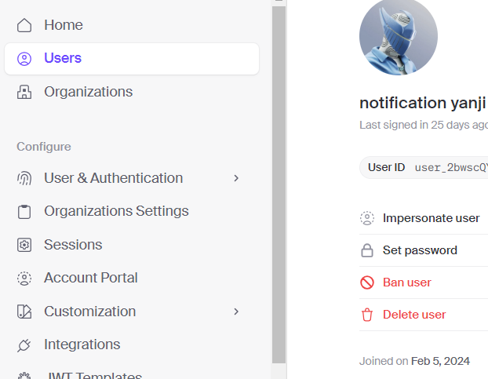

# UDEMY CLONE


> Simple LMS Web Application using Next, React, Stripe, Mux, Prisma, MySQL and more...

**Website: using local**

## 🤔 Why

This is project just for practice prisma and docker :D

## 🛠️ Config

Ok, to run this project you need config below. Because I'm so lazy to deploy ~.~. How to get all the key values you just scrolldown you can see how to get :D

##### .env file template

```bash
  NEXT_PUBLIC_CLERK_PUBLISHABLE_KEY=pk_test_abcdefegh # replace with your key
  CLERK_SECRET_KEY=sk_test_abcdefeghjj # replace with your key
  NEXT_PUBLIC_CLERK_SIGN_IN_URL=/sign-in
  NEXT_PUBLIC_CLERK_SIGN_UP_URL=/sign-up
  NEXT_PUBLIC_CLERK_AFTER_SIGN_IN_URL=/
  NEXT_PUBLIC_CLERK_AFTER_SIGN_UP_URL=/

  # This was inserted by `prisma init`:
  # Environment variables declared in this file are automatically made available to Prisma.
  # See the documentation for more detail: https://pris.ly/d/prisma-schema#accessing-environment-variables-from-the-schema

  # Prisma supports the native connection string format for PostgreSQL, MySQL, SQLite, SQL Server, MongoDB and CockroachDB.
  # See the documentation for all the connection string options: https://pris.ly/d/connection-strings

  DATABASE_URL="mysql://admin:<your_mysql_password>@localhost:<your_port>/<your_db_name>?schema=public" # this will auto create for you when init prisma or you can custom like me :D

  # upload thing
  # visit: https://docs.uploadthing.com/getting-started/appdir

  UPLOADTHING_SECRET=sk_live_abbbddssee # replace with your key
  UPLOADTHING_APP_ID=abcd123 # replace with your key

  MUX_TOKEN_ID=
  MUX_TOKEN_SECRET=

  STRIPE_API_KEY=sk_test_abcedefa # replace with your key
  STRIPE_WEBHOOK_SECRET= whsec_abedaweb # replace with your key

  NEXT_PUBLIC_APP_URL=http://localhost:3000

  NEXT_PUBLIC_TEACHER_ID=user_abc123  # replace with your user id
```

## 🐣 How to run

Constructed utilizing NextAuth, Clerk, Mux, Uploadthing, and database hosted on Docker, you are advised to adhere to the ensuing procedures:

**Step 1**: 
- Go to ClerkJS documents to get the key for Auth config [Visit now](https://dashboard.clerk.com/apps/app_2bwpoxsuAx2d4Jau0JZovKagj41/instances/ins_2bwpoyvr2kBLHKrl9wQffswlGDM/api-keys)
- Get ID of user by **Copy button id** whom you want to be a teacher so that user can access to teacher dashboard



**Step 2**: Go to Uploadthing to get the key for store the image, video and more [Visit now](https://uploadthing.com/dashboard/s67zr7l2zr/api-keys)

**Step 3**: Go to Mux Video to get the key for store video of coures.

-   Before you visit, you need to notice this. If you use Free plan this site will delete your videos after a week, so don't suprise why you lost your videos :))
-   [Visit here](https://dashboard.mux.com/organizations/i2d6j2/settings/access-tokens)

**Step 4**: Checkout

- **🚫 Warning**: You need to ensure to turn on test mode if you don't want lose your money :))
- [Visit here](https://dashboard.stripe.com/test/apikeys) to get Api key

**Step 5**: 
- Open terminal type `docker-compose up` (you need ensure you are at `docker\mysql` to run it, by using `cd`)

### Well done, enjoy my project ❤️‍🔥

## ⚖️ License

MIT. Made with 💖
